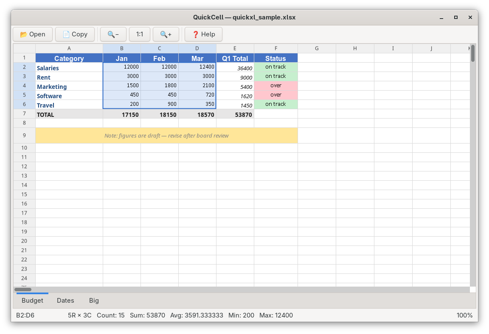

# QuickCell

A minimal read-only `.xlsx` viewer for GNOME/Linux. Built so you can peek at an Excel file someone sent you without firing up LibreOffice.



## Features

- Read-only — the file is never written back
- Supports `.xlsx` and `.xlsm`
- Sheet tabs (one per worksheet), at the bottom like Excel
- Formula bar at the top — shows the raw formula for the selected cell
- Click/drag to select a cell or a range
- Click a column or row header to select the whole column/row
- Ctrl+A selects all cells (or all text, when focus is in the formula bar)
- Copy (Ctrl+C) copies the selection as tab-separated text, ready to paste anywhere
- Zoom with Ctrl+scroll, Ctrl+±, or Ctrl+0 to reset
- Keyboard navigation (arrows, Home/End, PgUp/PgDn, Ctrl+Home/End)
- Merged cells respected
- Opens with a filename on the command line
- Large files load on a background thread with a spinner and per-stage status
- **Background formula evaluation** for cells without a cached value (see below)

## Installation

### System packages

```bash
# Fedora
sudo dnf install python3-gobject gtk3 cairo-gobject

# Ubuntu/Debian
sudo apt install python3-gi gir1.2-gtk-3.0 python3-cairo

# Arch
sudo pacman -S python-gobject gtk3 cairo
```

### Python deps

```bash
pip install openpyxl
```

## Usage

```bash
python3 quickcell.py                          # empty, then File → Open
python3 quickcell.py /path/to/report.xlsx     # open directly
```

## Controls

| Action | Input |
|---|---|
| Select cell / range | Click / click-drag |
| Extend selection | Shift+click, Shift+arrow |
| Select column / row | Click column / row header |
| Select all cells | Ctrl+A, or click top-left corner |
| Select all text in formula bar | Ctrl+A (while focused in it) |
| Navigate | Arrow keys, Home, End, PgUp, PgDn |
| Jump to A1 / last cell | Ctrl+Home / Ctrl+End |
| Copy selection (TSV) | Ctrl+C |
| Open file | Ctrl+O |
| Zoom | Ctrl+scroll, Ctrl++, Ctrl+−, Ctrl+0 |
| Switch sheet | Click tab, or Ctrl+PgUp / Ctrl+PgDn |

## Notes on formulas

QuickCell first uses the **cached formula result** stored in the file — the value that Excel (or LibreOffice, Google Sheets, etc.) computed the last time it saved. Any spreadsheet file written by a real spreadsheet app will have these cached values, so formulas "just work" for normal inspection.

Files produced purely by scripts (e.g. `openpyxl.Workbook().save(...)` without ever being opened by a spreadsheet app) have no cached values. For those cells, QuickCell evaluates the formula itself on a background worker thread, only for cells that actually become visible, so opening a big file stays snappy:

- **Yellow tint + "…"** — the cell is queued for evaluation or currently being computed.
- **Red "Error"** — the formula references something unsupported, hits a divide-by-zero, or contains a circular reference.
- Cross-sheet refs within the same file work (`tbl_afmetingen!A:A`, `'Sheet With Spaces'!A1`).
- External workbook refs, VBA, named ranges, and array formulas are not supported — those show "Error".

### Supported Excel functions

Math / aggregates:
`SUM`, `AVERAGE` / `AVG`, `MIN`, `MAX`, `COUNT`, `COUNTA`, `COUNTIF`, `SUMIF`, `PRODUCT`, `ABS`, `ROUND`, `INT`, `MOD`, `SQRT`, `POWER`

Logic:
`IF` (short-circuits), `IFERROR` (short-circuits), `AND`, `OR`, `NOT`, `TRUE`, `FALSE`

Text:
`CONCAT` / `CONCATENATE`, `&` operator, `LEN`, `LEFT`, `RIGHT`, `MID`, `UPPER`, `LOWER`, `TRIM`, `VALUE`

Lookup:
`INDEX` (1-D), `MATCH` (exact match `0`; approximate match `1`)

Operators:
`+`, `-`, `*`, `/`, `^`, `&`, `=`, `<>`, `<`, `<=`, `>`, `>=`, unary `+`/`-`, parentheses

Refs:
`A1`, `$A$1`, `$A1`, `A$1`, `A1:B10`, `A:A` (whole column), `1:1` (whole row), `Sheet!A1`, `'Sheet Name'!A1`

`COUNTIF` / `SUMIF` criteria understand comparison prefixes (`">5"`, `"<=3"`, `"<>x"`) and wildcards (`*`, `?`, with `~` as an escape).

## License

MIT
